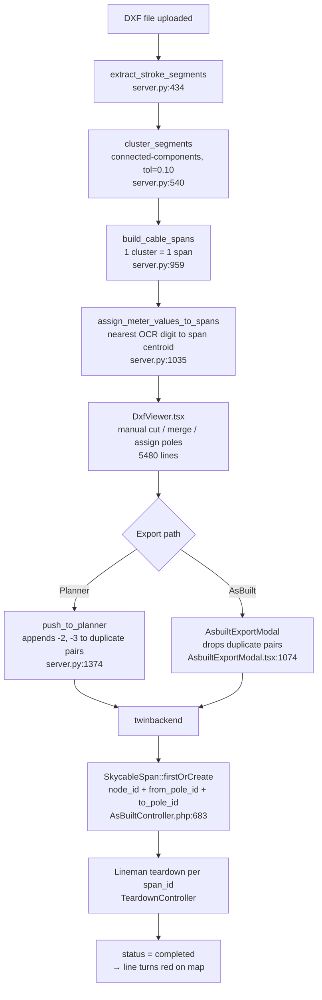

# Span Pairing — As-Is Process & Problem Analysis

**Date:** 2026-07-26
**Systems:** `Telcovantage-Site-Map-Reader` (DXF reader / Next.js + Flask) → `twinbackend` (Laravel)
**Status:** Analysis only. No design decision made yet.

---

## 1. What "span" means in each system

The two systems do **not** agree on what a span is. This disagreement is the root of every symptom below.

| System | Definition of a span | Identity key |
|---|---|---|
| **Site-Map-Reader** (DXF) | A **connected cluster of cable line segments** found on the CAD cable layer | `span_id` = index of the cluster after sorting by position |
| **twinbackend** (Laravel) | A **cable run between two adjacent poles** — a teardown work unit | `(node_id, from_pole_id, to_pole_id)` + a human `span_code` |

The reader derives spans from **geometry**. The backend defines spans by **pole topology**. Geometry is an unreliable proxy for topology: CAD drafters break lines, use dashes, split polylines at text crossings, and draw one polyline through ten poles. Every failure mode below follows from this mismatch.

---

## 2. End-to-end flow (as-is)



### Stage detail

**Stage 1 — Segment extraction** ([server.py:434](../../server.py#L434))
Reads LWPOLYLINE / LINE / ARC / HATCH entities from every layer whose name contains `cable` or `tx56` ([server.py:942](../../server.py#L942)). Each entity is exploded into straight `Segment` records.

**Stage 2 — Clustering** ([server.py:540](../../server.py#L540))
Union-find over segment **endpoints** using a spatial grid. Two segments join the same cluster if any endpoints are within `CABLE_CONNECT_TOL = 0.10` drawing units ([server.py:143](../../server.py#L143)).

> This is the single most consequential parameter in the system, and it is a hard-coded constant with no per-drawing calibration.

**Stage 3 — Span construction** ([server.py:959](../../server.py#L959))
One cluster → one span dict. `from_x/from_y` is the first segment's start point; `to_x/to_y` is the last segment's end point — **in arbitrary segment order**, not path order. Spans are then re-numbered `0..n` sorted by `(-cy, cx)`.

**Stage 4 — Meter value assignment** ([server.py:1035](../../server.py#L1035))
Each span grabs the nearest OCR'd strand-length digit within `avg_span_size * 0.5` of its **centroid**. A broken span has a small bbox and a shifted centroid, so it often grabs the wrong digit or none at all.

**Stage 5 — Manual correction in the viewer** ([DxfViewer.tsx](../../app/components/dxf/DxfViewer.tsx))
The operator fixes what the geometry got wrong, using:
- Auto-Connect Cables — nearest-pole assignment to span endpoints
- Cut at pole — splits one span into two ([DxfViewer.tsx:3067](../../app/components/dxf/DxfViewer.tsx#L3067))
- Merge with neighbor ([DxfViewer.tsx:3339](../../app/components/dxf/DxfViewer.tsx#L3339))
- `source_span_id` tracks which original cluster a piece came from, so export can re-collapse them ([DxfViewer.tsx:764](../../app/components/dxf/DxfViewer.tsx#L764))

This is where "ang hirap i-toggle ng lines" lives. The operator is manually reconstructing pole topology that the system never modeled.

**Stage 6 — Export.** Two different paths that disagree with each other (see §3.3).

**Stage 7 — Backend ingest** ([AsBuiltController.php:683](file:///C:/twinbackend/app/Http/Controllers/Api/Skycable/AsBuiltController.php))
```php
$span = SkycableSpan::firstOrCreate(
    ['node_id' => $node->id, 'from_pole_id' => $fromSkId, 'to_pole_id' => $toSkId],
    ['strand_length' => ..., 'span_code' => $this->generateSpanCode($node), 'status' => 'pending']
);
```
Dedupe key is the **ordered** pole pair. `span_code` is a global running counter per city prefix (`MNL-1`, `MNL-2`, …) — it carries no topological meaning and cannot be regenerated deterministically.

**Stage 8 — Teardown** ([TeardownController.php](file:///C:/twinbackend/app/Http/Controllers/Api/Skycable/TeardownController.php))
Lineman starts a report against `span_id`, uploads photos, submits. On `backendApprove` the span goes `status = completed`, and a pole is marked `cleared` only when it has no remaining non-completed spans. The map then renders that span red.

---

## 3. Failure modes

### 3.1 Explosion — one physical span becomes many span IDs

**Symptom (user's words):** *"kung 5 ---- from pole 1 ------ pole 2, andaming span id."*

**Cause:** The cable between pole 1 and pole 2 is drawn as 5 disconnected polylines (dashed linetype exploded, gaps at text crossings, endpoints further apart than `0.10`). Clustering produces 5 clusters → 5 spans, all resolving to the same pole pair.

**What each export path does with them:**

| Path | Code | Behavior |
|---|---|---|
| Planner | [server.py:1374](../../server.py#L1374) | Appends an occurrence counter — `NODE-P1-P2`, `NODE-P1-P2-2`, … 5 distinct span codes uploaded |
| AsBuilt | [AsbuiltExportModal.tsx:1085](../../app/components/dxf/../AsbuiltExportModal.tsx#L1085) | Keeps **one** span, drops the rest |

```python
# server.py:1374 — the duplicate-pair band-aid
pole_pair = tuple(sorted([from_code, to_code]))
occurrence = pole_pair_counts.get(pole_pair, 0) + 1
pole_pair_counts[pole_pair] = occurrence
if occurrence == 1:
    pole_span_code = f"{node_id}-{from_code}-{to_code}"
else:
    pole_span_code = f"{node_id}-{from_code}-{to_code}-{occurrence}"   # ← creates the extra span IDs
```

**Downstream impact:** The lineman tears down one physical span but sees 5 work items. Four stay `pending` forever, so `pole.skycable_status` never reaches `cleared` (the check requires *no* non-completed spans on the pole — [TeardownController.php:361](file:///C:/twinbackend/app/Http/Controllers/Api/Skycable/TeardownController.php)). Node roll-up totals and the red-line render are both wrong.

### 3.2 Collapse — many physical spans become one span ID

**Symptom (user's words):** *"nagiging single — nagiging 1 span id."*

**Cause:** The opposite geometry. A single LWPOLYLINE is drawn straight through poles 1→2→3→4→5. It is one connected cluster, so it is one span. `from_pole` is resolved from the first endpoint and `to_pole` from the last, so poles 2, 3 and 4 are invisible to the model.

**Downstream impact:** The backend receives one span covering five poles. Intermediate poles have zero spans attached, so they can never be cleared through the normal path. The lineman tears down pole 2–3 with no work item to report against.

### 3.3 Silent data loss on the AsBuilt path

When duplicates are collapsed, only `components` are summed. `strand_length` is taken from the single "winning" span:

```ts
// AsbuiltExportModal.tsx:1085
const kept = group.reduce((best, candidate) =>
  compareResolvedSpanPriority(candidate, best) > 0 ? candidate : best);
const mergedComponents = group.reduce(
  (counts, span) => addComponentCounts(counts, span.components), {...EMPTY_COMPONENTS});
return { ...kept, components: mergedComponents };   // ← strand_length from `kept` only
```

A 100 m run broken into 5 × 20 m clusters uploads as **20 m**. The drop is logged to `console.warn` only — invisible in production.

The two export paths therefore produce **different totals from the same drawing**: Planner over-counts spans, AsBuilt under-counts cable.

### 3.4 Direction instability

The reader emits `from`/`to` from arbitrary segment ordering. The backend dedupe key is the **ordered** pair `(from_pole_id, to_pole_id)`. If the same drawing is re-exported and the segment order flips, `firstOrCreate` sees a new key and creates a **second span** for the same physical cable. `TeardownController::storeDirect` has an `$isReversed` workaround, which confirms this happens in practice.

### 3.5 No stable span identity across re-imports

- `span_id` in the reader is a positional index — it changes when any cluster is added, removed, or moved.
- `span_code` in the backend is a global counter — not derivable from topology.
- `importBySequence` **rejects** a node_id that already exists ([AsBuiltController.php:385](file:///C:/twinbackend/app/Http/Controllers/Api/Skycable/AsBuiltController.php)), so a corrected drawing cannot be re-imported over an existing node.

Consequence: once a node is imported with wrong spans, there is no supported correction path. Teardown history is anchored to span rows that cannot be re-derived.

### 3.6 Manual toggling is unbounded work

Because span boundaries are geometric, every drawing needs hand correction: cut at each pole the cluster passed through, merge each fragment the clustering split. On a node with 60 poles this is hundreds of interactions in a 5,480-line canvas component. The tooling is a symptom, not a solution — it exists because pole topology is never derived.

---

## 4. Root cause

> **Spans are derived from cable geometry, when they should be derived from pole topology.**

The correct definition is already in the backend's schema: a span is the cable between **two adjacent poles**. The reader never computes pole adjacency. It computes segment connectivity and hopes it matches.

Everything else is compensation for that one inversion:

| Compensation | Location | What it papers over |
|---|---|---|
| `-2`, `-3` code suffixes | server.py:1374 | Over-segmentation |
| `source_span_id` + collapse-for-export | DxfViewer.tsx:764 | Manual splits polluting export |
| Duplicate-pair drop | AsbuiltExportModal.tsx:1085 | Over-segmentation, again — differently |
| Cut / merge / auto-connect UI | DxfViewer.tsx:3067–3400 | Both over- and under-segmentation |
| `$isReversed` handling | TeardownController.php:437 | Unstable direction |
| `backfillSpanCodes` | AsBuiltController.php:486 | Missing deterministic identity |

Six independent band-aids for one modeling error. They interact — which is why the Planner and AsBuilt paths now disagree.

---

## 5. The shape of a fix (not yet decided)

Any real solution has to answer these, in order:

1. **Derive pole adjacency, not segment connectivity.** Snap cable geometry onto the pole set, then walk the cable path pole-to-pole. A span becomes the path *between consecutive poles along the cable*. Over-segmentation and under-segmentation both disappear, because cluster count stops mattering — only the ordered pole sequence does.
2. **Make span identity deterministic and direction-free.** Key on the *unordered* pole pair within a node. Same drawing → same span keys, every time, on both sides of the wire.
3. **Aggregate, never drop.** When multiple geometry fragments map to one pole pair, sum their lengths. Never silently keep one.
4. **One export path.** Planner and AsBuilt must build the payload from the same function.
5. **Support re-import.** A corrected drawing must be able to update an existing node without destroying teardown history.

---

## 6. Open questions for the team

1. **Is a pole always drawn on the cable path?** If poles sit offset from the line, what snap radius is acceptable?
2. **Are there spans without a pole at both ends** — drops to buildings, taps, dead-ends? Are those spans at all?
3. **Branches / T-taps:** if a cable branches at a pole, is each branch a span? Does the pole then have 3+ spans?
4. **What happens to existing nodes** already imported with exploded spans? Migrate, or leave and fix forward?
5. **Where should the fix live** — reader-side (compute correct spans before upload), backend-side (merge on ingest), or both?
6. **Is `strand_length` per span or per run?** `expected_cable = strand_length * number_of_runs` in the backend, but the reader sends OCR'd meter values whose meaning may differ.

---

## 7. File reference

**Site-Map-Reader**
- [server.py:143](../../server.py#L143) — `CABLE_CONNECT_TOL`
- [server.py:434](../../server.py#L434) — `extract_stroke_segments`
- [server.py:540](../../server.py#L540) — `cluster_segments`
- [server.py:942](../../server.py#L942) — `find_cable_layer_names`
- [server.py:959](../../server.py#L959) — `build_cable_spans`
- [server.py:1035](../../server.py#L1035) — `assign_meter_values_to_spans`
- [server.py:1093](../../server.py#L1093) — `push_to_planner`
- [server.py:4516](../../server.py#L4516) — `v1_asbuilt_import_by_sequence`
- [app_python/api/public_api.py:575](../../app_python/api/public_api.py#L575) — duplicate `GET /api/v1/cable_spans` on an **unregistered blueprint (dead code)**; the live routes are [server.py:3658](../../server.py#L3658) (`/api/cable_spans`, what the viewer fetches) and [server.py:4125](../../server.py#L4125) (`/api/v1/cable_spans`)
- [app/components/dxf/DxfViewer.tsx](../../app/components/dxf/DxfViewer.tsx) — viewer, cut/merge/assign
- [app/components/AsbuiltExportModal.tsx](../../app/components/AsbuiltExportModal.tsx) — AsBuilt payload builder

**twinbackend**
- `app/Models/SkycableSpan.php`
- `app/Models/SkycablePole.php`
- `app/Models/SkycableSpanSummary.php`
- `app/Http/Controllers/Api/Skycable/AsBuiltController.php` — `importBySequence`, `upsertNodeSpan`, `generateSpanCode`
- `app/Http/Controllers/Api/Skycable/TeardownController.php` — teardown lifecycle
- `app/Http/Controllers/Api/Skycable/SpanController.php`
